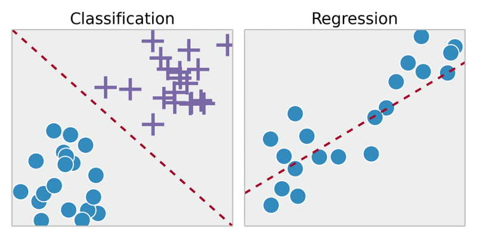
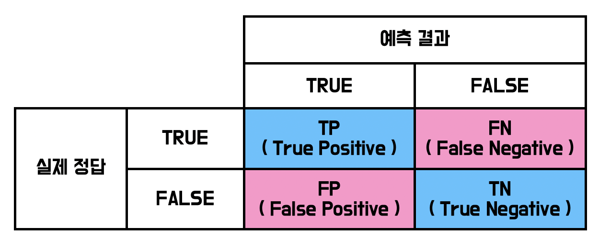

# BMS 2021 

## Chapter - 3 : 분류
### 발표자 : 박준영

### 분류(Classification) : 클래스 레이블 예측
- 분류는 지도학습의 일환으로 과거의 관측을 기반으로 새로운 샘플의 범주형 클래스를 예측하는 것이 목적
- 클래스 레이블이 두 개의 클래스로 구성되어 있다면 이진 분류(Binary Classification)이라고 한다.
- 클래스 레이블이 두 개 이상의 클래스로 구성되어 있다면 다중 분류(Multiclass Classification)이라고 한다.

### 분류 문제
- 분류 문제를 풀기 위해선 분류 모형이 필요하다.
- 분류 모형은 크게 두가지로 나뉘어 진다.

1. 확률적 모형 : 주어진 데이터에 대해 클래스가 정답일 조건부확률을 계산하는 모형

    - 확률적 판별모형 : 조건부확률 함수 모형을 추정.(로지스틱 회귀, 의사결정 트리)
    - 확률적 생성모형 : 베이즈 정리를 이용해 간접적으로 조건부확률 계산 (나이브 베이지안)
        
2. 판별 함수

    - 주어진 데이터를 클래스에 따라 영역을 나누는 경계선을 찾아내고 경계선을 기준으로 데이터가 위치하는 곳을 판별하는 함수(퍼셉트론, 인공신경망, 서포트 벡터 머신)

## 분류모델 성능 평가

### 정확도의 문제

### Confusion Matrix

### Accuracy
- 전체 데이터 중 올바르게 예측한 비율
- TP + TN / (TP + FN + FP + TN)

### Recall(재현율)
- 실제 True 중 예측 True의 비율
- Recall은 실제 True를 False로 잘못판단하면 위험한 경우에 의미가 있다. 
- 실제 코로나가 양성인 환자를 음성으로 판단하면 위험하다.
- TP / (TP + FN)

### Precision(정밀도)
- 예측 True 중 실제 True의 비율
- Precision은 실제 False를 True라고 판단하면 위험한 경우
- 스팸메일이 아닌 것을 스팸메일이라고 분류한 경우
- TP / (TP + FP)

### F1-Score
- Recall과 Precision의 조화평균
- 어느 한 쪽으로 치우치면 Score가 낮다

### Threshold
- 임계값을 이용해 Recall, Precision을 높일 수 있다.

### ROC Curve, AUC
- ROC Curve는 FPR(False Positive Rate)이 변할 때 TPR(True Positive Rate)이 어떻게 변하는지 나타내는 곡선
- TPR = 재현율(민감도)
- FPR = FP / (FP + TN)
- AUC(Area Under the Cover)로 ROC 커브 아래의 면적을 의미한다.

**성능지표는 데이터 분석의 목적에 따라 어울리는 평가지표를 활용해야 한다.**
